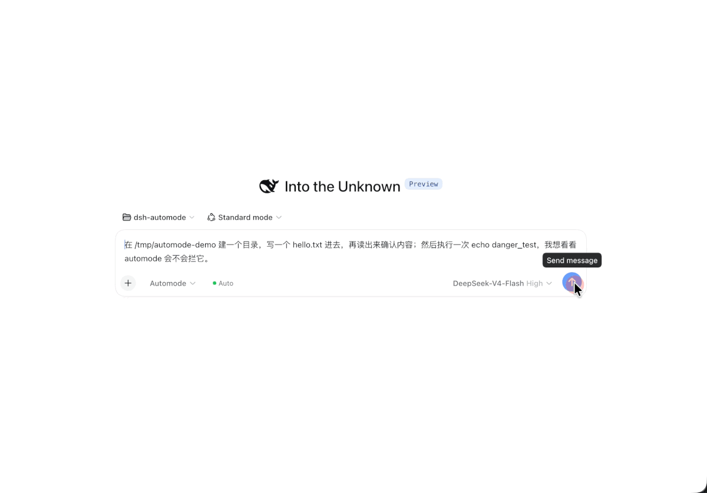

# dsh-auto-approval

[English](README.md) | [中文](README.zh.md)

给 DeepSeek Harness 加**第四档权限**：在输入栏的权限下拉里选 **Automode**，会话就以完全权限运行，唯一的安全闸门是一个 LLM 分类器——它替你回答每一次判定，**不再弹审批**。

权限模型保持 3 + 1：官方三档沙箱，外加一档全托管。选其它 preset 即等于关掉本插件，没有第二个开关。

> **0.2.0 是对 0.1.x 的重写。** 开关从插件设置改成了权限 preset：装好、选 **Automode**，就完事。升级见 [从 0.1.x 升级](#从-01x-升级)。

## 演示



录屏内容：选 **Automode**，发一条 prompt（建目录 → 写文件 → 读回确认 → 执行 `echo danger_test`）。文件那几步全程无人值守通过（`L1-deep` / `whitelist`），最后那条命令被硬规则拦下（`L0-deny`）；chip 弹窗同时显示两条判定和累计计数。

## 工作原理

```text
模型要调工具
        │
        ├─ preset ≠ automode ──────────────► 完全不接管（官方行为）
        │
        └─ preset = automode
                 │
                 ├─ L0 规则（硬底线）────────► deny   (rm -rf /、curl | sh、自毁命令 …)
                 ├─ 免检工具 / bash 前缀 ────► allow
                 └─ L1 分类器 ──────────────► allow | deny   （fail-closed：超时/解析失败/无模型 → deny）
```

- **L0** —— 正则 deny 规则 + 自毁护栏 + 免检工具/命令前缀白名单，确定性判定，不调模型。
- **L1** —— 拿「最近一条真实用户消息 + 裸工具调用」给分类器。两个 backend：**`llm`**（默认）走聊天模型的两阶段 prompt（fast 单 token 过滤 → 命中才走 deep CoT）；**`jev`** 向 TypeSafe System One 发一次 HTTP 请求拿回类型化概率，判定就是阈值比较，没有文本解析。两个 backend 下**分类器都永远看不到工具输出**，所以被注入的内容没法把它骗成 allow。
- **fail-closed** —— 超时、解析失败、没有模型，一律 deny。

automode preset 写的是和「完全权限」同一组旋钮（完全权限 + 审批 `never`），所以其它通道也不会再问人；两者的区别就是本插件这道闸门。官方 preset 服务会记住最后选中的名字，所以下拉里能区分你选的是哪一档。

## 安装

```sh
dsh plugin --profile web add dsh-auto-approval
```

> **刚发新版？** pnpm 11 默认拒绝发布不足 24 小时的版本（`minimumReleaseAge`，供应链保护），所以发布当天 `add dsh-auto-approval` 会解析到**上一个版本**。要么装精确版本（`dsh plugin --profile web add dsh-auto-approval@0.2.0`），要么在 profile 的 `pnpm-workspace.yaml` 里加：
>
> ```yaml
> minimumReleaseAgeExclude:
>   - dsh-auto-approval
> ```

然后在输入栏旁的权限下拉里选 **Automode**（或 `/permission automode`）。第一次选会在浏览器里弹一次性提示，说明这档的取舍（官方那个「Enable Full access?」确认硬编码在 `danger-full-access` 键上，自定义 preset 不会触发）。之后预设选择器旁边会出现 `Auto` 胶囊：累计放行/拦截计数，点开是决策表。

源码方式：clone 后 `pnpm install && pnpm run build`，再 `dsh plugin --profile web add link:/<路径>`。

## 从 0.1.x 升级

0.2.0 保留了包名、`auto-approval:` 配置段和所有配置项，升级不需要改配置。变的是：

| | 0.1.x | 0.2.0 |
|---|---|---|
| 开关 | 插件设置 `enabled` + UI 里的 switch | **Automode** 权限 preset（没有第二个开关） |
| 包 | `dsh-auto-approval` + `dsh-client-ui-auto-approval` | `dsh-auto-approval`（host + 浏览器半边同一个包） |
| 沙箱 | 看当前 preset；DSH 自己的升级询问照旧弹给用户 | 完全权限 + 审批 `never`，完全不弹窗 |
| L1 未配置 | 全部放行（橡皮图章） | 白名单外一律拒绝 |

```sh
# 1. 卸掉旧的伴侣包（浏览器半边现在就在主包里）
dsh plugin --profile web remove dsh-client-ui-auto-approval

# 2. 升级
pnpm --dir "$DSH_HOME/profiles/web" up dsh-auto-approval

# 3. 重启 dsh，然后在权限下拉里选 Automode
```

如果 `settings.yaml` 里没配分类器（`classifierFastProvider` / `classifierFastModel`），automode 现在会 fail-closed——配上它，否则只有免检工具和白名单命令能跑。

## 配置

配置就是本插件的 profile entry——在 Web UI 的 **Settings → Plugins** 里编辑，或直接手改 `$DSH_HOME/profiles/web/cordis.patch.yml`。DSH 0.1.7 起这些字段是 volatile 的：改动热生效到运行中的会话（不重挂载）；非法的在线更新会被拒绝并保留上一份好配置。旧的 `$DSH_HOME/settings.yaml` 会被 DSH 一次性导入后改名：

```yaml
- id: auto-approval
  name: dsh-auto-approval
  config:
    denyPatterns:
      - 'rm\s+(-[a-z]*[fr][a-z]*\s+)*/\s*$'
      - 'curl\s+[^|]*\x7c\s*(ba)?sh'
    autoApproveTools: [read, write, edit, glob, grep, ls]
    bashCommandPrefixes: [ls, pwd, git status, git diff, pnpm test]
    classifierFastProvider: deepseek-official
    classifierFastModel: deepseek-v4-flash
    classifierDeepProvider: deepseek-official
    classifierDeepModel: deepseek-v4-pro
    classifierGuidance: '只读命令和跑测试优先放行。'
```

所有键都可选。`denyPatterns` / `autoApproveTools` / `bashCommandPrefixes` 是**整体替换**默认值（YAML 数组不合并），要保留的默认项得自己写全。

不配分类器就没有 L1，此时 automode **fail-closed**：只有免检工具和白名单命令能跑，其余一律拒绝。这是故意的——没有分类器的会话不是安全兜底，默认放行只会让这道闸门变成橡皮图章。

### Jev backend（TypeSafe System One）

`classifierBackend: jev` 把两阶段 LLM prompt 换成一次 [Jev](https://docs.typesafe.ai/api) 类型化概率调用。Jev 不生成文本：一次请求对同一个帧（最近用户消息 + tool 名 + 参数）回答五个问题、返回校准概率，判定就是代码里的一次阈值比较——整条文本解析链路（VERDICT 行、截断收尾、token 预算）不复存在。一次往返约 300ms。

```sh
export TYPESAFE_API_KEY=<你的密钥>   # 推荐方式，见下方警告
```

```yaml
auto-approval:
  classifierBackend: jev
  # 可选：
  jevModel: jev-latest        # 默认值；响应带实际版本号，记进日志供追溯
  jevAllowThreshold: 0.9      # 默认值；必须落在开区间 (0, 1)
```

超时复用 `classifierTimeoutMs`，不新增键。不要把 `classifierBackend: jev` 和 `classifierFast*`/`classifierDeep*` 路由同时配置——歧义配置在加载期直接 throw（fail-loud）。密钥从 `jevApiKey` 解析，缺省回退 `TYPESAFE_API_KEY` 环境变量。**警告：`jevApiKey` 写进 profile patch 就是明文落盘——优先用环境变量。** 密钥永不出现在日志、审计事件或 deny reason 里。

**一个闸门，四个证人。** 一次请求问五个问题，只有 `clearly_safe` 参与判定：`noul ≥ jevAllowThreshold` 放行，否则拒绝。`destructive`、`exfiltration`、`beyond_scope`、`impact` **只记录、不拦**——它们的合理阈值必须在你自己的真实 session 上量出来（分类器阈值跨数据集不迁移是普遍教训），先读几十条真实判定日志里的信号分布，再决定要不要升格为闸门。每条 Jev 判定都会在文件日志里写一行，含五个信号数值、`usage.input_tokens` 和实际回答的模型版本号。

**速率与「不重试」的取舍。** jev-1.13 限额 1200 请求/分钟、250k token/秒；输出 token 免费，输入计费（撰文时 $0.042/MTok）。闸门永不重试：429/529（或任何失败）直接拒绝这次调用，不给工具流水线加尾部延迟。撞到限额的表现是「automode 拒绝并告诉你」，而不是「automode 挂起」。

## 权限与数据

| 面 | 本插件做什么 |
|---|---|
| 读 | 待判定的工具调用参数；session 的 `autoApprovalIntent` projection（仅用于取最近一条真实用户消息作为分类器意图） |
| 写 | `$DSH_HOME/logs/auto-approval.log`——本机 JSONL 审计文件，best-effort；写失败只记 warn |
| 网络 | 仅当配置了 L1。`llm` backend：用户消息 + 工具调用发给所配置的模型服务。`jev` backend（默认关闭）：**最近一条真实用户消息**（截断到 4000 字）、**tool 名**、**参数 JSON**（截断到 8000 字）发往 `https://api.typesafe.ai/v1/systemone`。两个 backend 都**永不发送 tool 输出**——这是注入防线，不是巧合 |
| 执行 | 不执行任何东西。不起子进程、不走 shell、不改审计文件以外的文件 |
| 拦截 | `tools/pre-execute`（prepend）+ 单调 `ctx.tools.guard()` deny 守卫，两者都按会话 preset 门控 |
| 失败边界 | L1 超时 / 解析失败 / 无模型 → **deny**；配置非法在加载时 throw（fail-loud）；配置来自 profile entry，非法的在线更新保留上一份好配置 |

## 兼容性

只跟官方最新版走。已在 `@deepseek-ai/dsh` **0.1.7-rc.1** 上实测通过（一次性 `DSH_HOME`：安装 → 启动 → 真实 tool call 判定）。旧版本（0.1.5 及以下）不保证。

bundle patch 会整体重述官方 preset 表，所以官方基础层新增 preset 时这个文件也要跟着更新。注意：你自己的 profile patch 是更上层的层——如果它重述了 `permission` 行，必须把 `automode` preset 自己写进去（后层覆盖本包的 bundle patch），且 `defaultPreset` 归用户所有。

## 开发

```sh
pnpm install
pnpm run typecheck
pnpm run test
pnpm run build     # lib/index.js（host）+ lib/client.js（browser）
```

## License

BSD-3-Clause
