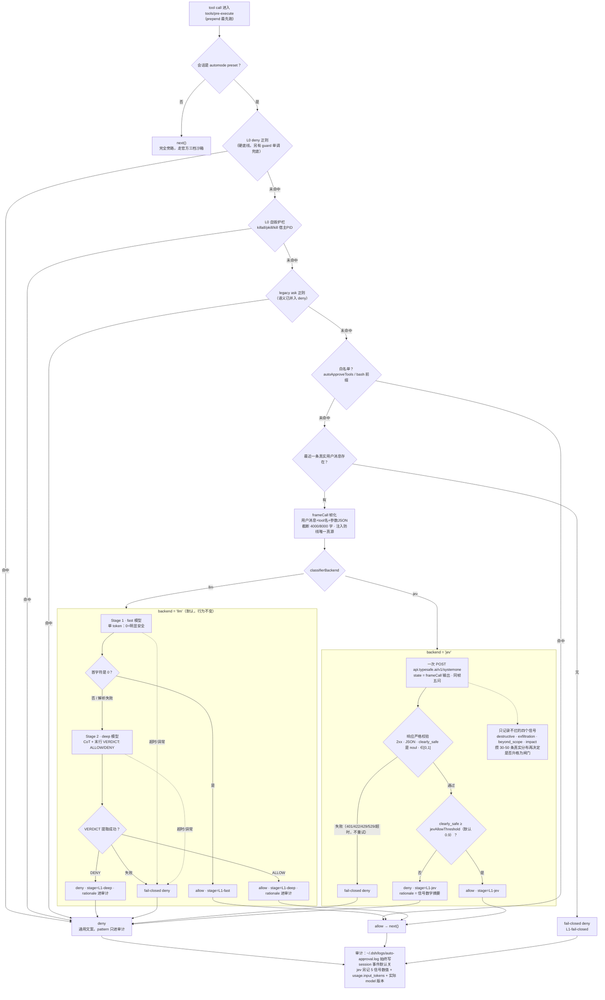

# Automode 决策流水线（含 Jev backend）

> 与 `src/` 实现的对应关系：preset 门控与 L0 在 `index.ts` / `rules.ts`，
> 帧化在 `frame.ts`，两个 backend 分别在 `classifier.ts`（llm）与
> `jev.ts`（jev），审计在 `audit.ts`。

读图要点：

- **分水岭在 `classifierBackend`**：preset 门控、L0、白名单、意图提取、frameCall
  两条 backend 完全共享，改动半径只在 L1 内部。
- **jev 分支没有 Stage 1/2**：一次请求替代两次模型调用，判定从"解析文本"
  退化为"比较一个数"。
- **五个问题同帧发出**，四个辅助信号只进日志、不参与判定（虚线旁路）。
- **所有失败路径都收口到 deny**：图里不存在任何"出错 → 放行"的边。
